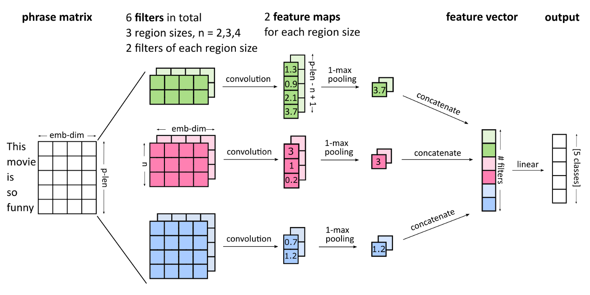

# NeuroMovieSentiment

<p align="center">
    
</p>

## Teammembers
- Daniela Ruchser
- Daniel Betsche 
- Alan Mazankiewicz 


## Repository Overview

[Experiment introduction](##Experiment)

[Installation](##Installation)

[Running the Experiments](##Running)

[References](##References)

## Experiment

The conducted experiment within this repository is to classify sentiment on Movie Reviews extracted from rotten Tomatoes. The data is provided by this [Kaggle Challenge](https://www.kaggle.com/c/sentiment-analysis-on-movie-reviews)

The task is build a neural network-based model to predict the reviews as of five sentiment categories:
- 0: Negative
- 1: Somewhat Negative
- 2: Neutral
- 3: Somewhat Positive
- 4: Positive

There are several Experiments nested within the _modelle_ folder. We build 3 models from which we consider one (CNN in _modelle/main_model_) as our main solution while we use the other two (two LSTM variants in _modelle/side_model_) to compare against. Further, we compare against the model described in  Socher et al., 2013 (Stanford CoreNLP in _modelle/external_model_). Beside this we did some exploratory analysis of the data in _analysis_.


## Installation

It is recommended to use a Kaggle-Kernel / Kaggle script for the provided experiments. In case you still want to run these on your local machine continue reading

After you clone the repository it is advised to create a virtual environment and install the required packages within

### Using Virtualenv:

It is assumed you have Virtualenv alread installed. If not please follow these [instructions](https://virtualenv.pypa.io/en/latest/installation/)
```bash
mkdir movie_sentiment
virtualenv movie_sentiment
source movie_sentiment/bin/activate
pip install -r requirements.txt
```

### Using Conda

It is assumed you have Conda alread installed. If not please follow these [instructions](http://docs.anaconda.com/anaconda/install/)
```bash
conda create --name movie_sentiment python=3.7
source activate movie_sentiment
conda install --yes --file requirements.txt
```

## Running

- To run the experiments on Kaggle-Kernel upload the given notebook / script to Kernel, activate GPU and internet connection and run.
- To run on local machines follow the instructions in [Installation](##Installation) and run scripts using the CommandLine and notebooks using Jupyter Notebook.

Note: In case the Standord CoreNLP should be run in addition to [Installation](##Installation) download 'stanford-corenlp-full-2018-10-05', (see https://stanfordnlp.github.io/CoreNLP/index.html#download) (only tested on local machines)

## References
Socher, R., Perelygin, A., Wu, J., Chuang, J., Manning, C.D., Ng, A. and Potts, C., 2013. Recursive Deep Models for Semantic Compositionality over a Sentiment Treebank. In Proceedings of the 2013 Conference on Empirical Methods in Natural Language Processing (pp. 1631-1642).

Kim, Y. (2014). Convolutional neural networks for sentence classification. arXiv preprint arXiv:1408.5882.


https://github.com/bentrevett/pytorch-sentiment-analysis/blob/master/4%20-%20Convolutional%20Sentiment%20Analysis.ipynb

https://github.com/bentrevett/pytorch-sentiment-analysis/blob/master/2%20-%20Upgraded%20Sentiment%20Analysis.ipynb
